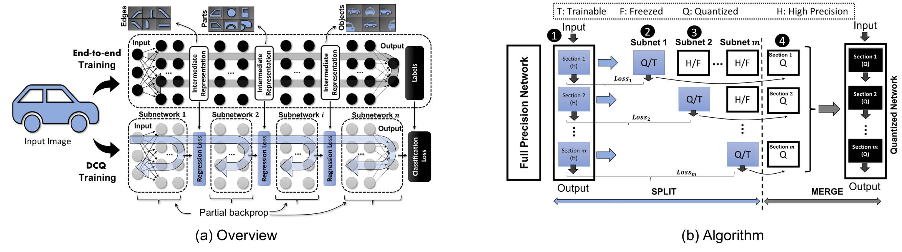

# DCQ (Divide and Conquer for Quantization):

## Leveraging Intermediate Feature Representations for Quantized Training of Neural Networks

**Example Usage:**

- Specify the quantization bits of each layer in the network specific yaml file:

dcq.code/dcq/examples/classifier_compression/alexnet_bn_dorefa.yaml

- Print the model to know the index of each layer of the target network

dcq.py >> print(model)

- Determine  the split point of the network by freezing all layers except those of the particular stage to be trained

dcq.py line 572 >> model.freeze_partial([0, 2])

- Return the right activation map for intermediate learning by specifiying the right index based on the printed model layers indices

dcq.code/dcq/models/imagenet/alexnet_batchnorm.py (line 84)

- Run the following command

python3 dcq.py --arch alexnet_bn ../../../data.imagenet_100 --epochs 5 --fpresume alexnet_bn.pth.tar --resume alexnet_bn.pth.tar --lr 0.005 --quantize-eval --compress alexnet_bn_dorefa.yaml --gpus 2,3

--fpresume "path to the full precision reference model"

--resume "path to the model to be quantized and trained"
